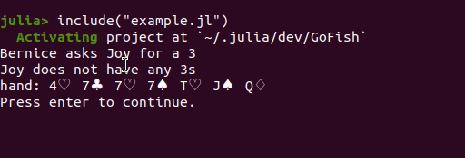

# GoFish

GoFish.jl is a Julia package for playing and simulating the card game Go Fish. 

# Installing GoFish.jl

To install GoFish.jl, enter the following into the REPL:

```julia
] add https://github.com/itsdfish/GoFish.jl
```

# Playing Go Fish

You can play Go Fish interactively within the Julia REPL using the keyboard. Interactive play requires creating a dictionary of players, a game object, and passing both to the play function. The human player must be a `Human`, but the other players can be any subtype of `AbstractPlayer`.
```julia 
using GoFish
ids = (:you, :Joy,:Bernice)
types = (Human,Player,Player)
players = Dict(id => t(;id) for (t,id) in zip(types,ids))
game = PlayGame(;ids = ids)
play(game, players)
```



# Running a Simulation

Simulating Go Fish requires a dictionary of players, and a game object. Players must be a subtype of `AbstractPlayer`. If using heterogenous types, use a dictionary of type `Dict{I,Union{T1,..}}` to improve performance. The following code is a minimum working example of a simulation. 

```julia
using GoFish
ids = (:Penelope,:Manuel,:Beelzebub)
players = Dict(id => Player(;id) for id in ids)
game = Game(ids)
deal!(game, players)
simulate!(game, players)
```
The outcome of the simulation can be found with `game.books`. 
# Creating a Custom Player

GoFish.jl allows you to create a player with custom behavior. The process involves creating a new subtype of `AbstractPlayer` and defining a decision method and three optional methods for tracking the exchange of cards. 

At minimum the custom subtype requires a field `id` and `cards`. Additional fields can be included as needed.
```julia
mutable struct MyPlayer{T} <: AbstractPlayer
    id::T
    cards::Vector{Card}
end
```

The decision logic of the player is written in the method `decide`. This method receives the player object, and a set of player ids. `decide` must return a player id and a card value.  
```julia 
function decide(player::MyPlayer, ids)
    # awesomeness goes here
    return player_id,card_value
end
```
The player's representation of the game is optionally updated through three methods: `process_exchange!`, `process_go_fish!`, and `process_books!`. The method `process_exchange!` allows the player to observe and process an exchange of cards between the inquirer and the opponent.
```julia 
function process_exchange!(player::MyPlayer, inquirer_id, opponent_id, value, cards)
    # awesomeness goes here
end
```
`process_go_fish!` allows the player to observe and that a player received an unknown card after going fish. `process_go_fish!` is also called when a player runs replinishes an empty hand. 
```julia 
function process_go_fish!(player::MyPlayer, inquirer_id)
    # awesomeness goes here
end
```
Finally, `process_books!` allows the player to track which cards are no longer in play. The argument `book_map` is a dictionary that maps player id to a vector of cards 
```julia
function process_books!(player::AbstractPlayer, book_map)
    # awesomeness goes here
end
```

# Help

Additional documentation for functions exported through the API can be called through the REPL with

```julia
? function_name
```
