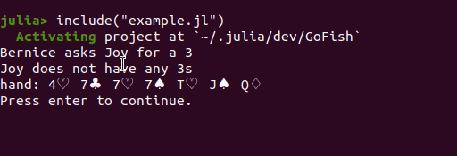

# Playing Go Fish

You can play Go Fish interactively within the Julia REPL using the keyboard. Interactive play requires creating a dictionary of players, a game object, and passing both to the play function. The human player must be a `Human`, but the other players can be any subtype of `AbstractPlayer`. The following example shows how to play interactively through the REPL. In this example, your opponents are [Bernice and Joy](https://youtu.be/X2CzeRaZrYc?t=4). 

```julia 
using GoFish
ids = (:you, :Bernice,:Joy)
types = (Human,Player,Player)
players = Dict(id => t(;id) for (t,id) in zip(types,ids))
game = InteractiveGame(;ids = ids)
play(game, players)
```

